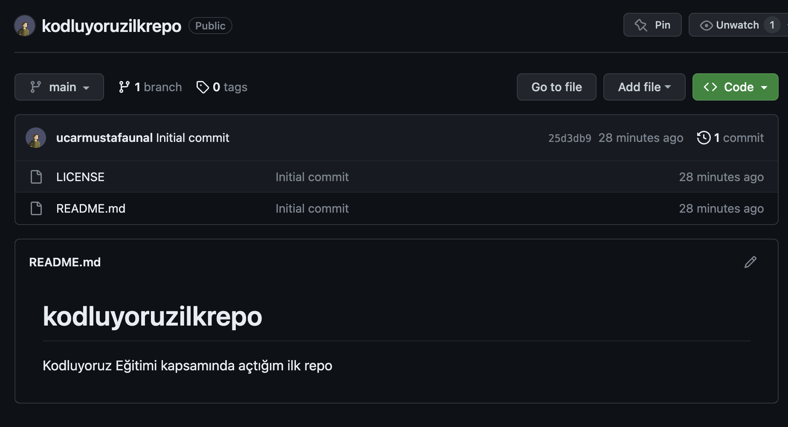

# Kodluyoruz Ilk Repo

Bu repo, [Kodluyoruz](https://kodluyoruz.org/) Git-Hub Eğitiminde oluşturduğum Repository'dir. İçerisinde bir adet **README** dosyası, bir adet de [index.html](index.html) barındırıyor.

## Installation

Öncelikle projeyi clonelayın. [link](https://github.com/ucarmustafaunal/kodluyoruzilkrepo)

< https://github.com/ucarmustafaunal/kodluyoruzilkrepo

## Usage

Projeyi cloneladıktan sonra Visual Studio Code programında açınız.

Linux için:

< cd kodluyoruzilkrepo
< code .

## Contributing

Pull requestler kabul edilir. Büyük değişiklikler için, lüften önceden neyi değiştirmek istediğinizi tartışmak için konu açınız.

## License

[MIT](https://choosealicense.com/licenses/mit/)